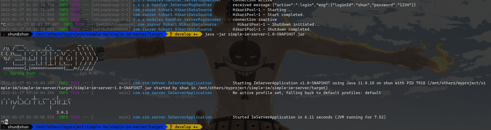
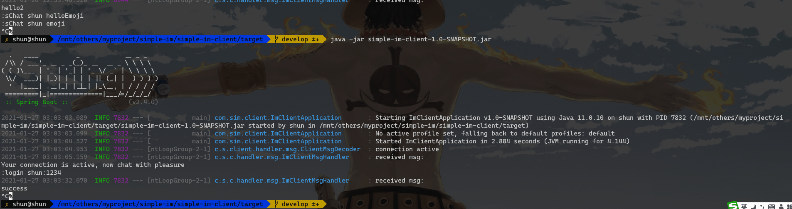
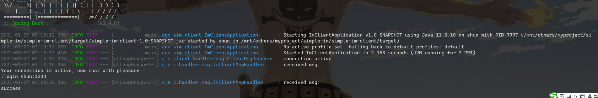

## another simple im framework
### demo
#### db init
> database file is in db/db.sql, just create a database which name is configure in simple-im-server/src/main/resources/application.yml, then init with the db.sql

#### running
+ packaging
> package all the modules `mvn clean package`
+ start server
> start server in `simple-im-server` module by running `java -jar simple-im-server-1.0-SNAPSHOT.jar`

 
+ start client
> start client in `simple-im-client` module by running `java -jar simple-im-client-1.0-SNAPSHOT.jar`

+ start chatting
> start chatting by starting typing in the client windows

### support message type
all commands stick to the format like `:command args`, here are the commands that currently support:

+ show support command list
> :help  
+ login
> :login loginId:password
+ show online userList
> :onlineUserList
+ createGroup
> :createGroup groupName
+ group list
> :groupList  
+ joinGroup
> :joinGroup groupName
+ show current user's join group list
> :joinedGroupList
+ quitGroup
> :quitGroup groupName
+ show group memberList
> :gMemberList
+ single chat
> :sChat targetLoginId message
+ group chat
> :gChat targetGroupName message

### TODO
+ invite user to join group support
